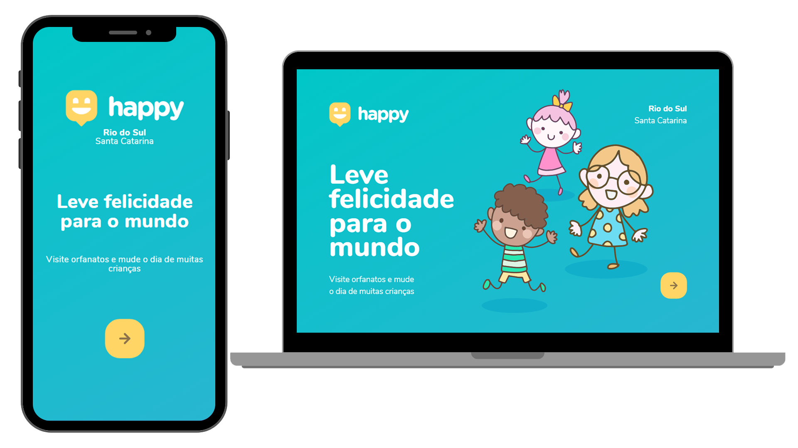

<h1 align="center">
  
   Next Level Week #3 
  JavaScript | HTML | CSS
</h1>

  
  
   
   

  <a href="#bookmark-sobre">Sobre</a>&nbsp;&nbsp;&nbsp;|&nbsp;&nbsp;&nbsp;
  <a href="#rocket-tecnologias">Tecnologias</a>&nbsp;&nbsp;&nbsp;|&nbsp;&nbsp;&nbsp;
  <a href="#paintbrush-layout">Layout no Figma</a>&nbsp;&nbsp;&nbsp;|&nbsp;&nbsp;&nbsp;
  <a href="#memo-licença">Licença</a>

  

## :bookmark: Sobre

O **Happy** é uma aplicação Desktop e Mobile feita para auxiliar a integração entre a comunidade e lares de acolhimento. Logo, esta aplicação oferece aos lares possibilidades de adicionar mais abrigos e ampliar a quantidade de visitantes e pais adotivos, podendo adicionar informações como horários de atendimento, para quem é destinado, localização e instruções para visita.
  
Essa aplicação foi desenvolvida durante a 3° edição da **Next Level Week**, realizada pela [Rocketseat](https://rocketseat.com.br/).

## :rocket: Tecnologias

-  [HTML](https://developer.mozilla.org/pt-BR/docs/Web/HTML/)
-  [Handlebars](https://handlebarsjs.com/)
-  [CSS](https://developer.mozilla.org/pt-BR/docs/Web/CSS/)
-  [JavaScript](https://developer.mozilla.org/pt-BR/docs/Web/JavaScript/)
-  [Node.js](https://nodejs.org/en/docs/)
-  [SQLite](https://www.sqlite.org/docs.html/)
-  [Express](https://expressjs.com/)

## :paintbrush: Layout

Clique aqui para abrir o layout do projeto no [Figma](https://www.figma.com/file/0o6IOVcmfEhtO4ZJM7xL27/Project-Happy---NLW%233?node-id=0%3A1) feito por [Tiago Luchtenberg](https://www.instagram.com/tiagoluchtenberg/).

## :memo: Licença

Esse projeto está sob a licença MIT. Veja o arquivo [LICENSE](LICENSE.md) para mais detalhes.

---
README.md baseada no projeto [Proofy](https://github.com/HigorSnt/proffy) de [HigorSnt](https://github.com/HigorSnt).
 Projeto desenvolvido com a tutoria de [Mayk Brito](https://github.com/maykbrito), da [Rocketseat](rocketseat.com.br).
